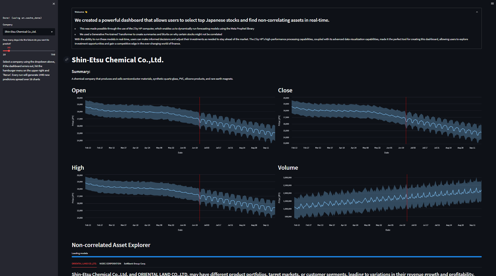

# Summary
I created a powerful dashboard that allows users to select top Japanese stocks and find non-correlating securities in real-time. This was made possible through the use of the Z by HP computer, which enabled me to dynamically run forecasting models using the Meta Prophet library and generative text generation. The combination of these technologies allowed for quick and accurate analysis of vast amounts of data to identify the most promising investment opportunities. With the ability to run these models in real-time, users can make informed decisions and adjust their investments as needed to stay ahead of the market. The Z by HP's high-performance processing capabilities, coupled with its advanced data visualization capabilities, made it the perfect tool for creating this dashboard, allowing users to explore investment opportunities and gain a competitive edge in the ever-changing world of finance.

**Please don't make financial decisions based on this model**

# Instructions
1. Clone this Git repository using the following command: `git clone https://github.com/kshashank03/HP-Sales-Video.git`
1. Using the terminal or command prompt, `cd` into `HP-Sales-Video`
1. Check if you have Python installed on your machine by typing `python --version` in your terminal or command prompt window. If Python is not installed, download and install Python from the official website.
1. Create a virtual environment for the project using the following command:
    * `python -m venv <YOUR_ENV_NAME>`
1. Activate the virtual environment using the following command:
    * On Windows: 
        * If you're using command line: `<YOUR_ENV_NAME>\Scripts\activate.bat`
        * If you're using PowerShell: `<YOUR_ENV_NAME>\Scripts\Activate.ps1`
    * On Linux/Mac: source `<YOUR_ENV_NAME>/bin/activate`
1. Install the required packages using pip by running the following command:
    * `pip install -r requirements.txt`
1. Launch the Streamlit app by running the following command:
    * `streamlit run japanese_stock_prediction.py`
